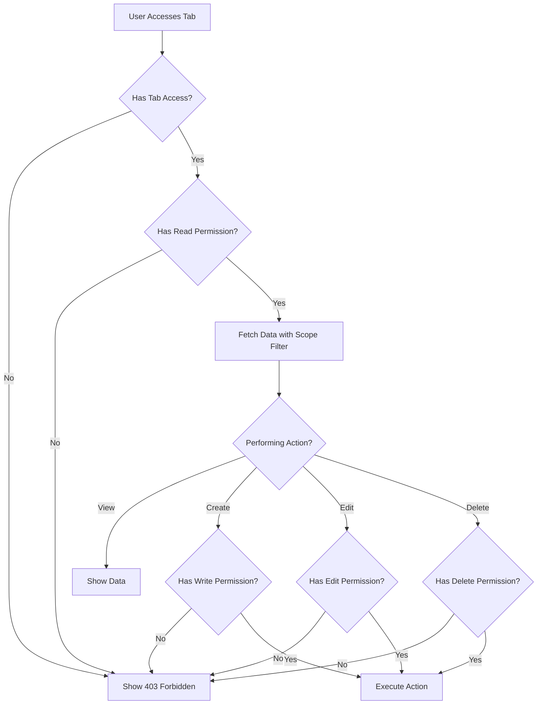

# RR TMS - System Hierarchy Flow & Permission Model

## Document Version
**Version:** 1.0  
**Last Updated:** November 29, 2025  
**Author:** System Documentation

---

## Table of Contents
1. [System Overview](#system-overview)
2. [Organizational Hierarchy](#organizational-hierarchy)
3. [Role-Based Access Control (RBAC)](#role-based-access-control-rbac)
4. [Permission System](#permission-system)
5. [User Scope & Access Levels](#user-scope--access-levels)
6. [Dashboard Tab Permissions](#dashboard-tab-permissions)
7. [Data Access Rules](#data-access-rules)

---

## 1. System Overview

**RR TMS (Retail Rockets Task Management System)** is a multi-tenant, hierarchical task and ticket management platform designed for organizations with complex structures involving multiple clients, branches, and departments.

### Key Features:
- **Multi-Tenant Architecture**: SuperAdmin can manage multiple client organizations
- **Dynamic Role Management**: Roles can be created/modified with custom permissions
- **Granular Permission Control**: Read, Write, Edit, Delete permissions per module/tab
- **Hierarchical Data Scoping**: Users only see data relevant to their scope
- **Audit Trail**: Complete logging of all system activities

---

## 2. Organizational Hierarchy

```
┌─────────────────────────────────────────────────────────────┐
│                        SUPER ADMIN                          │
│               (Global Access - RR System)                   │
│                  - Manages entire system                    │
│                  - Creates clients                          │
│                  - Creates roles & permissions              │
│                  - Controls all configurations              │
└──────────────────────────┬──────────────────────────────────┘
                           │
        ┌──────────────────┴──────────────────┐
        │                                     │
┌───────▼─────────┐               ┌──────────▼─────────┐
│   CLIENT 1      │               │   CLIENT 2         │
│  (Tenant Org)   │               │  (Tenant Org)      │
│  - Company A    │               │  - Company B       │
└───────┬─────────┘               └──────────┬─────────┘
        │                                    │
        │ Managed by: CLIENT ADMIN           │
        │ (Client-Level Access)              │
        │                                    │
┌───────▼──────────────────────────┐         │
│  BRANCHES (Stores/Locations)     │         │
│  ├── Branch 1 (Mumbai)           │         │
│  ├── Branch 2 (Delhi)            │         │
│  └── Branch 3 (Bangalore)        │         │
└───────┬──────────────────────────┘         │
        │                                    │
        │ Managed by: BRANCH MANAGER         │
        │ (Branch-Level Access)              │
        │                                    │
┌───────▼───────────────────────────┐        │
│  DEPARTMENTS (within Branch)      │        │
│  ├── Sales                        │        │
│  ├── Operations                   │        │
│  ├── HR                           │        │
│  └── Finance                      │        │
└───────┬───────────────────────────┘        │
        │                                    │
        │ Managed by: DEPARTMENT HEAD        │
        │ (Department-Level Access)          │
        │                                    │
┌───────▼─────────────────────┐              │
│  USERS                      │              │
│  ├── Anchor (Special Role)  │              │
│  └── Regular Users          │              │
└─────────────────────────────┘              │
```

### Hierarchy Levels:

| Level | Entity | Managed By | Scope | Hierarchy Level |
|-------|--------|------------|-------|-----------------|
| 1 | **System** | SuperAdmin | Global | 100 |
| 2 | **Client** | SuperAdmin | Client-Level | 80 |
| 3 | **Branch** | ClientAdmin | Branch-Level | 60 |
| 4 | **Department** | BranchManager | Department-Level | 40 |
| 5 | **User** | DepartmentHead | User-Level | 10-20 |

---

## 3. Role-Based Access Control (RBAC)

### System Roles (Default)

The system comes with 6 predefined roles that can be customized:

#### 3.1 SuperAdmin (Hierarchy Level: 100)
```yaml
Role: SuperAdmin
Scope: Global
Description: RR System Administrator
Permissions: ALL
Scope Requirements:
  - Client: Not Required
  - Branch: Not Required
  - Department: Not Required
Access Level: 
  - Full system access
  - Manage all clients
  - Create/manage roles
  - Configure system settings
  - View all audit logs
```

**Capabilities(permission based):**
- ✅ Create clients (organizations)
- ✅ Create branches for any client
- ✅ Create departments in any branch
- ✅ Create and manage roles
- ✅ Assign permissions to roles (R, W, E, D)
- ✅ Create users with any role
- ✅ Manage system settings
- ✅ View all audit logs
- ✅ Access all projects, tasks, tickets across all clients

---

#### 3.2 ClientAdmin (Hierarchy Level: 80)
```yaml
Role: ClientAdmin
Scope: Client-Level
Description: Client Organization Administrator
Scope Requirements:
  - Client: REQUIRED ✓
  - Branch: Not Required
  - Department: Not Required
Access Level:
  - Full access within assigned client
  - Can manage branches
  - Can create projects
  - Can assign tasks to client users
```

**Capabilities(permission based):**
- ✅ Create branches within their client(permission based)
- ✅ Create departments in client branches
- ✅ Create users within their client (with scope restrictions)
- ✅ Create projects for their client
- ✅ Create and assign tasks
- ✅ View reports for their client
- ❌ Cannot access other clients' data
- ❌ Cannot create/modify roles
- ❌ Cannot access SuperAdmin features


---

#### 3.3 BranchManager (Hierarchy Level: 60)
```yaml
Role: BranchManager
Scope: Branch-Level
Description: Branch/Store Manager
Scope Requirements:
  - Client: REQUIRED ✓
  - Branch: REQUIRED ✓ (Can manage multiple branches)
  - Department: Not Required
Access Level:
  - Full access within assigned branch(es)
  - Can manage departments
  - Can assign tasks to branch users
```

**Capabilities(permission based):**
- ✅ Manage assigned branch(es)
- ✅ Create departments in their branch
- ✅ Create users in their branch
- ✅ View/assign tasks for their branch
- ✅ Manage tickets for their branch
- ✅ View branch-level reports
- ✅ Can manage multiple branches (if configured)
- ❌ Cannot access other branches (unless assigned)
- ❌ Cannot create projects


---

#### 3.4 DepartmentHead (Hierarchy Level: 40)
```yaml
Role: DepartmentHead
Scope: Department-Level
Description: Department Head/Manager
Scope Requirements:
  - Client: REQUIRED ✓
  - Branch: REQUIRED ✓
  - Department: REQUIRED ✓ (Can manage multiple departments)
Access Level:
  - Access to assigned department(s) only
  - Can manage department users
  - Can assign tasks to department users
```

**Capabilities(permission based):**
- ✅ Manage users in their department(s)
- ✅ View/assign tasks for their department
- ✅ Create tickets for their department
- ✅ View department-level reports
- ✅ Can manage multiple departments (if configured)
- ❌ Cannot access other departments
- ❌ Cannot create branches or projects


---

#### 3.5 Anchor (Hierarchy Level: 20)
```yaml
Role: Anchor
Scope: User-Level (Special)
Description: Support/Resolution Specialist
Scope Requirements:
  - Client: REQUIRED ✓
  - Branch: REQUIRED ✓
  - Department: REQUIRED ✓
Access Level:
  - Special permissions for ticket management
  - Can resolve tickets across departments
  - Enhanced task visibility
```

**Capabilities(permission based):**
- ✅ View/manage tickets across departments (within client)
- ✅ Resolve tickets assigned to them
- ✅ Escalate tickets
- ✅ Create tasks from tickets
- ✅ Update task status
- ❌ Cannot create projects
- ❌ Cannot manage users

**Special Features:**
- Auto-assignment of tickets based on availability
- Enhanced ticket resolution permissions
- Can change ticket status: open → in_progress → resolved → closed

---

#### 3.6 User (Hierarchy Level: 10)
```yaml
Role: User
Scope: User-Level
Description: Regular system user
Scope Requirements:
  - Client: REQUIRED ✓
  - Branch: REQUIRED ✓
  - Department: REQUIRED ✓
Access Level:
  - Access to assigned tasks and tickets only
  - Can view own data
```

**Capabilities(permission based):**
- ✅ View tasks assigned to them
- ✅ Acknowledge tasks
- ✅ Update task progress
- ✅ Complete checklists and subtasks
- ✅ Add comments
- ✅ Upload attachments
- ✅ Submit forms
- ✅ Create tickets
- ❌ Cannot create tasks
- ❌ Cannot assign tasks to others
- ❌ Cannot access unassigned data


---

## 4. Permission System

### 4.1 Permission Types

The system supports **8 granular permission types** that can be assigned to any role for any dashboard tab/module:

| Permission ID | Name | Code | Description | Typical Use |
|---------------|------|------|-------------|-------------|
| 1 | **Read** | `R` | View/list records | View tasks, tickets, users |
| 2 | **Write** | `W` | Create new records | Create tasks, projects |
| 3 | **Edit** | `E` | Modify existing records | Update task details |
| 4 | **Delete** | `D` | Remove records | Delete tasks, users |
| 5 | **Approve** | `A` | Approve/reject submissions | Approve forms, tasks |
| 6 | **Export** | `X` | Export data to CSV/Excel | Download reports |
| 7 | **Assign** | `S` | Assign tasks/tickets to users | Task assignment |
| 8 | **Manage** | `M` | Full control over module | Complete module access |

### 4.2 Dashboard Tabs/Modules

The system has **10+ dashboard tabs** that can be controlled:

| Tab ID | Tab Name | Display Name | Typical Modules |
|--------|----------|--------------|-----------------|
| 1 | `overview` | Dashboard Overview | Statistics, KPIs |
| 2 | `clients` | Client Management | Client CRUD |
| 3 | `branches` | Branch Management | Store/Branch CRUD |
| 4 | `departments` | Department Management | Department CRUD |
| 5 | `users` | User Management | User CRUD, Roles |
| 6 | `projects` | Project Management | Project CRUD |
| 7 | `tasks` | Task Management | Task CRUD, Assignment |
| 8 | `tickets` | Ticket Management | Ticket CRUD, Resolution |
| 9 | `forms` | Form Builder | Form templates, submissions |
| 10 | `reports` | Reports & Analytics | Data export, analytics |
| 11 | `audit` | Audit Logs | System activity logs |
| 12 | `settings` | System Settings | Configuration |
| 13 | `roles` | Role Management | Role & permission config |

### 4.3 Permission Matrix Example

Here's how permissions are assigned to roles:

#### SuperAdmin Permission Matrix:
```yaml
SuperAdmin (Role ID: 1):
  overview:     [R, W, E, D, A, X, S, M]  # Full access
  clients:      [R, W, E, D, X, M]        # Full client control
  branches:     [R, W, E, D, X, M]        # Full branch control
  departments:  [R, W, E, D, X, M]        # Full department control
  users:        [R, W, E, D, M]           # Full user control
  projects:     [R, W, E, D, X, M]        # Full project control
  tasks:        [R, W, E, D, A, X, S, M]  # Full task control
  tickets:      [R, W, E, D, A, X, S, M]  # Full ticket control
  forms:        [R, W, E, D, X, M]        # Full form control
  reports:      [R, X]                    # View & export reports
  audit:        [R, X]                    # View & export audit logs
  settings:     [R, W]                    # Configure system settings
  roles:        [R, W, E, D]              # Manage roles
```

#### ClientAdmin Permission Matrix:
```yaml
ClientAdmin (Role ID: 2):
  overview:     [R, X]                    # View client dashboard
  clients:      [R]                       # View own client only
  branches:     [R, W, E, D]              # Manage client branches
  departments:  [R, W, E, D]              # Manage departments
  users:        [R, W, E]                 # Create/edit users (within client)
  projects:     [R, W, E, D, X]           # Full project control (client scope)
  tasks:        [R, W, E, D, S, X]        # Manage & assign tasks
  tickets:      [R, W, E, X]              # View & update tickets
  forms:        [R, W, E, X]              # Create forms
  reports:      [R, X]                    # View client reports
  audit:        [R]                       # View client audit logs
  settings:     [R]                       # View settings only
  roles:        []                        # No role management access
```

#### User Permission Matrix:
```yaml
User (Role ID: 6):
  overview:     [R]                       # View personal dashboard
  clients:      []                        # No access
  branches:     []                        # No access
  departments:  []                        # No access
  users:        []                        # No access
  projects:     [R]                       # View assigned projects
  tasks:        [R, E]                    # View & update assigned tasks
  tickets:      [R, W, E]                 # Create & update tickets
  forms:        [W]                       # Submit forms
  reports:      []                        # No access
  audit:        []                        # No access
  settings:     []                        # No access
  roles:        []                        # No access
```

---

## 5. User Scope & Access Levels

### 5.1 Scope Assignment During User Creation

When **SuperAdmin creates a user**, they must:

1. **Select Role** → Determines base permissions
2. **Select Scope Level**:
   - **Client Level**: User can access all branches/departments in the client
   - **Branch Level**: User can access specific branch(es)
   - **Department Level**: User can access specific department(s)

3. **Assign Specific Entities**:
   ```yaml
   User Creation Form:
     - Name: John Doe
     - Email: john@client.com
     - Role: User
     - Client: ACME Corp (ID: 1)
     - Branch: [Mumbai Store] (ID: 5)  ← Multi-select if BranchManager
     - Department: [Sales] (ID: 12)     ← Multi-select if DepartmentHead
   ```

---

## 6. Dashboard Tab Permissions

### 6.1 How Tabs Populate Based on Role

When a user logs in, the system dynamically populates their dashboard based on:

1. **User's Role** → Determines which tabs they can see
2. **Role Permissions** → Determines actions (R/W/E/D) on each tab
3. **Scope** → Filters data within accessible tabs

#### Example: ClientAdmin Dashboard

```yaml
User: jane@acmecorp.com
Role: ClientAdmin
Client: ACME Corp (ID: 1)
Branches: All (client-level access)

Dashboard Tabs Populated:
  ✅ Overview        → [READ, EXPORT]
  ✅ Branches        → [READ, WRITE, EDIT, DELETE]
  ✅ Departments     → [READ, WRITE, EDIT, DELETE]
  ✅ Users           → [READ, WRITE, EDIT]
  ✅ Projects        → [READ, WRITE, EDIT, DELETE, EXPORT]
  ✅ Tasks           → [READ, WRITE, EDIT, DELETE, ASSIGN, EXPORT]
  ✅ Tickets         → [READ, WRITE, EDIT, EXPORT]
  ✅ Forms           → [READ, WRITE, EDIT, EXPORT]
  ✅ Reports         → [READ, EXPORT]
  ✅ Audit Logs      → [READ]
  ❌ Settings        → Not visible
  ❌ Role Management → Not visible
```

#### Example: Regular User Dashboard

```yaml
User: emp001@acmecorp.com
Role: User
Client: ACME Corp (ID: 1)
Branch: Mumbai Store (ID: 5)
Department: Sales (ID: 12)

Dashboard Tabs Populated:
  ✅ Overview        → [READ]  (Personal stats only)
  ✅ Tasks           → [READ, EDIT]  (Assigned tasks only)
  ✅ Tickets         → [READ, WRITE, EDIT]  (Own tickets)
  ✅ Forms           → [WRITE]  (Submit forms)
  ❌ All other tabs  → Not visible
```

### 6.2 Permission Checking Flow



---

## 7. Data Access Rules

### 7.1 Cross-Client Isolation

```yaml
Rule: Strict Tenant Isolation
  - Users from Client A CANNOT see data from Client B
  - Exception: SuperAdmin can see ALL clients
  
Implementation:
  - All queries include WHERE client_id = :user_client_id
  - Database triggers enforce isolation
  - API middleware validates client_id
```

### 7.2 Hierarchical Visibility

```yaml
Higher roles can see lower-level data:
  SuperAdmin      → Can see all clients, branches, departments, users
  ClientAdmin     → Can see all branches & departments in their client
  BranchManager   → Can see all departments in their branch(es)
  DepartmentHead  → Can see all users in their department(s)
  User            → Can see only assigned tasks/tickets
```

### 7.3 Assignment-Based Access

```yaml
Rule: Assignment Override
  - Users can access tasks/tickets assigned to them
  - Even if outside their normal scope
  
Example:
  User (Dept: Sales, Branch: Mumbai) 
  → Assigned task from Dept: Operations, Branch: Delhi
  → User CAN access this task despite scope mismatch
```

### 7.4 Creator Access

```yaml
Rule: Creator Ownership
  - Users can always access data they created
  - Useful for tasks, tickets, comments
  
Implementation:
  WHERE assigned_to = :user_id OR created_by = :user_id
```

---

## 8. Role & Permission Management Workflow

### 8.1 Creating a New Role (SuperAdmin Only)

```yaml
Step 1: SuperAdmin accesses "Roles" tab
Step 2: Clicks "Create Role"
Step 3: Fills role details:
  - Name: "Store Supervisor"
  - Display Name: "Store Supervisor"
  - Description: "Supervises store operations"
  - Hierarchy Level: 50 (between BranchManager and DepartmentHead)
  - Scope Level: Branch
  - Requirements:
      ✓ Requires Client
      ✓ Requires Branch
      ✗ Requires Department
      ✗ Can Manage Multiple Branches

Step 4: Assign tab permissions:
  
  Overview:     ✓ Read  ✓ Export
  Branches:     ✓ Read
  Departments:  ✓ Read  ✓ Write  ✓ Edit  ✓ Delete
  Users:        ✓ Read  ✓ Write  ✓ Edit
  Projects:     ✓ Read
  Tasks:        ✓ Read  ✓ Write  ✓ Edit  ✓ Assign
  Tickets:      ✓ Read  ✓ Write  ✓ Edit
  Forms:        ✓ Read  ✓ Write
  Reports:      ✓ Read  ✓ Export
  
Step 5: Save role
Step 6: Role is now available in user creation dropdown
```

### 8.2 Creating a User with Scope

```yaml
Step 1: SuperAdmin/ClientAdmin accesses "Users" tab
Step 2: Clicks "Create User"
Step 3: Fills user details:
  - Name: "Rajesh Kumar"
  - Email: "rajesh@acmecorp.com"
  - Phone: "+91-9876543210"
  - Role: "Store Supervisor" (newly created role)
  
Step 4: Select Scope:
  - Client: ACME Corp (auto-selected if ClientAdmin)
  - Branch: [Mumbai Store, Pune Store] (multi-select)
  - Department: Not applicable (role doesn't require it)
  
Step 5: Save user
Step 6: User receives email with login credentials
```

### 8.3 User Login & Dashboard Population

```yaml
Step 1: User logs in with credentials
Step 2: Backend validates credentials
Step 3: Backend fetches user role and permissions:
  
  SELECT u.*, r.*, rtp.*
  FROM users u
  JOIN roles r ON u.role_id = r.id
  JOIN role_tab_permissions rtp ON r.id = rtp.role_id
  WHERE u.id = :user_id

Step 4: Generate user permission object:
  
  {
    "user_id": 15,
    "role": "Store Supervisor",
    "client_id": 1,
    "store_ids": [5, 7],
    "department_ids": null,
    "permissions": {
      "overview": {"read": true, "export": true},
      "tasks": {"read": true, "write": true, "edit": true, "assign": true},
      "tickets": {"read": true, "write": true, "edit": true},
      ...
    }
  }

Step 5: Frontend renders dashboard tabs based on permissions
Step 6: Each tab loads data filtered by user scope
```

---

## 9. Security & Best Practices

### 9.1 Permission Enforcement

```yaml
✅ DO:
  - Always check permissions on backend
  - Validate user scope before data access
  - Use database-level role checks
  - Audit all permission changes

❌ DON'T:
  - Rely on frontend-only permission checks
  - Allow client_id manipulation in requests
  - Skip scope validation for "trusted" users
  - Hardcode role names in code
```

### 9.2 Audit Logging

```yaml
All permission-related actions are logged:
  - Role creation/modification/deletion
  - Permission assignment/revocation
  - User creation with scope
  - Scope changes
  - Access denied attempts
  
Audit Log Entry Example:
  {
    "user_id": 1,
    "action": "CREATE",
    "entity_type": "role",
    "entity_id": 8,
    "old_data": null,
    "new_data": {"name": "Store Supervisor", "hierarchy_level": 50},
    "ip_address": "192.168.1.100",
    "timestamp": "2025-11-29 14:30:00"
  }
```

---

## 10. Summary

### Hierarchy Flow:
```
SuperAdmin (Global)
  └── Creates Clients
       └── ClientAdmin (Client-Level)
            └── Creates Branches
                 └── BranchManager (Branch-Level)
                      └── Creates Departments
                           └── DepartmentHead (Department-Level)
                                └── Manages Users
                                     └── Anchor / User (User-Level)
```

### Permission Model:
1. **Roles** define base permission sets
2. **Tabs** represent system modules
3. **Permissions** (R/W/E/D/A/X/S/M) control actions
4. **Scope** (Client/Branch/Department) filters accessible data
5. **Dashboard** populates dynamically based on role + scope

### Key Points:
- ✅ SuperAdmin has full system control
- ✅ Roles are dynamic and customizable
- ✅ Permissions are granular (8 types)
- ✅ Scope ensures data isolation
- ✅ Users only see relevant data
- ✅ All actions are audited

---

**End of Hierarchy Flow Documentation**
